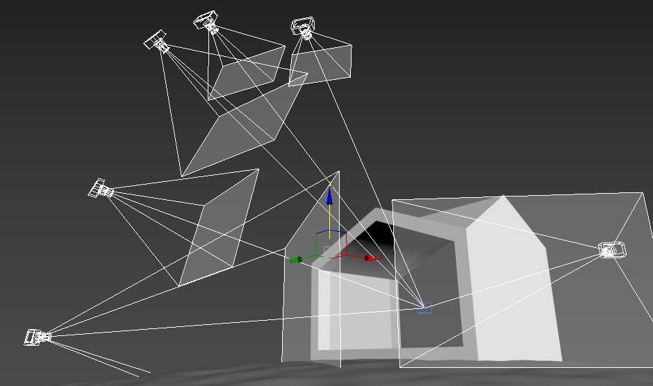
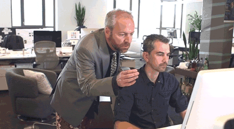
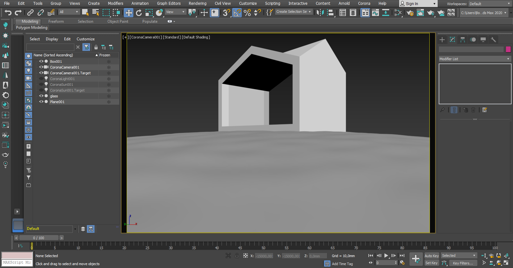
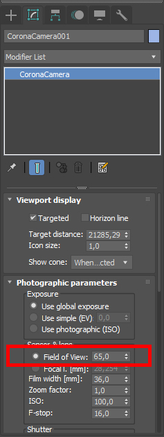
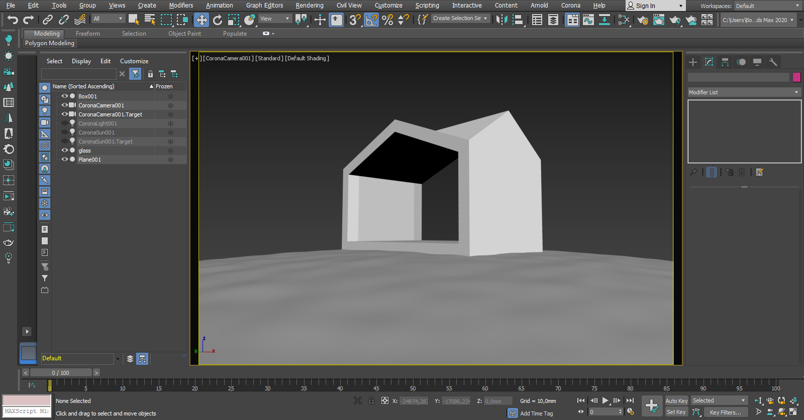
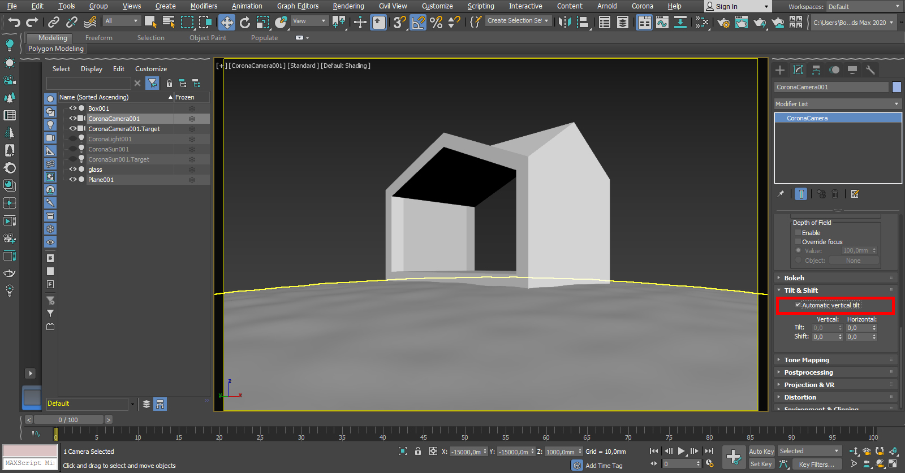
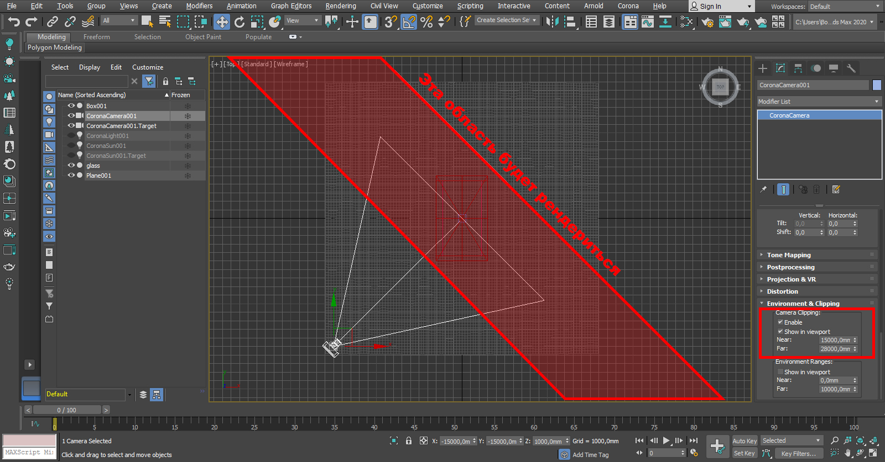
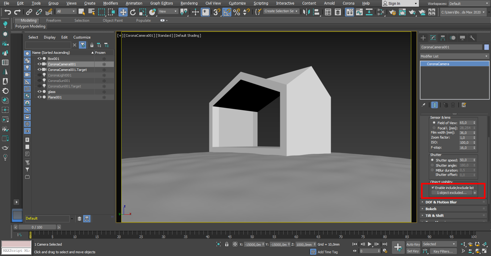
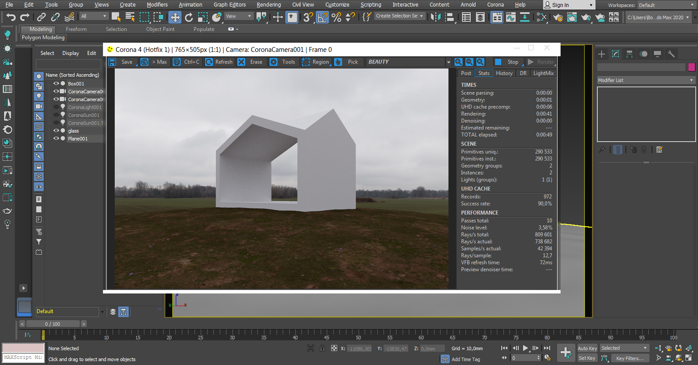
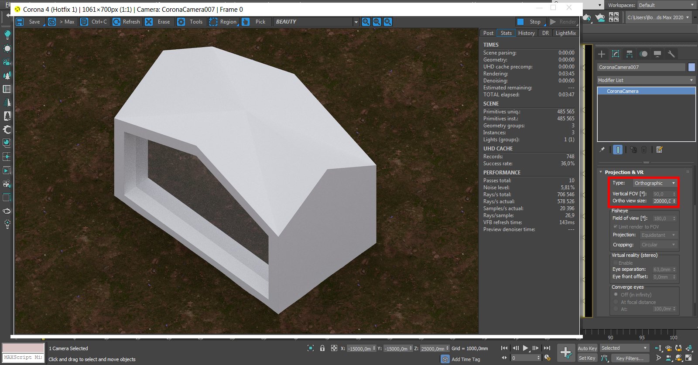

import { Aside } from '@astrojs/starlight/components';

После того, как вы [импортировали](../export-import/) свою архикадовскую модель в макс и [настроили естественный свет](../natural-light/) 
в сцене нужно настроить ракурсы, с которых вы будете рендерить своё здание. Наверняка, пока вы его моделили в архикаде, у вас сформировалось представление о том, 
с каких сторон вы его хотите показать, какие части и откуда смотрятся круто и т.д.

В этой статье мы научимся пользоваться камерами в максе и узнаем полезные функции Corona Camera.

## Устройство любых камер в 3ds max

Чтобы настроить и потом отрендерить нужные ракурсы мы будем размещать в сцене камеры. У камеры обычно есть две точки: 
- Первая точка представляет собой саму камеру
- Вторая _(target)_ — точка фокуса камеры

Чтобы всё получилось хорошо, нужно выставить эти самые две точки в нужные места и получить красивую композицию кадра. 
Иногда, если ракурс сложный или рядом со зданием находятся другие объекты, которые могут мешать, этот процесс затягивается.

_Будете мучиться так же, как этот мужик, только вместо унитаза будут камеры_

## Corona Camera

**Corona Camera** — очень удобный инструмент, появившийся в одной из версий короны _(в версии 1.7)_. 
Эта камера отличается наличием дополнительных настроек, отсутствующих в стандартной камере, вся следующая инфа будет именно про эту камеру.

Итак, первым делом создаём камеры. Делать это удобно на виде сверху, нажимаем на место, где будет стоять сама камера, тянем мышку и отпускаем там, где будет таргет.

_Камера на уровне земли_.

Если мы посмотрим на ракурс, созданный этой камерой, мы увидим, что камера расположена на уровне земли. Поднимаем камеру на высоту взгляда человека или немного ниже, 
а таргет поднимаем выше взгляда человека. Для установки высоты удобно использовать координаты в правом нижнем углу окна макса. 
Ставить камеру нужно именно на уровне глаз человека (~1,4-1,7 м) т.к. здание чаще всего именно с такой высоты и будет восприниматься — не для птиц же его спроектировали.

Также у камер есть параметр **“Field of View”** (FoV, угол обзора), он находится во вкладке **“Photographic parameters”** настроек камеры и отвечает за угол обзора камеры. 
Для обычной камеры архитектурной визуализации можно выставить угол 65 градусов или выше, по умолчанию в короне угол обзора 45 градусов. 
Если нужен близкий ракурс на какую-нибудь деталь, можно уменьшить параметр FoV, это приблизит картинку. 
Еще FoV нужно уменьшать для вертикальных ракурсов, т.к. угол обзора в максе задается для ширины рендера (а вот в фотике FoV будет отражать угол обзора по длинной стороне).

_Настройка угла обзора_.

Вот вы настроили расположение камеры и выбрали правильный угол обзора. Теперь поднимите таргет так, чтобы горизонт попал на нижнюю треть кадра 
([правило третей](https://ru.wikipedia.org/wiki/%D0%9F%D1%80%D0%B0%D0%B2%D0%B8%D0%BB%D0%BE_%D1%82%D1%80%D0%B5%D1%82%D0%B5%D0%B9)).

_Вертикали завалены_

### Выпрямление вертикалей

Теперь выпрямляем вертикали. Для этого нажимаем галочку **“Automatic vertical tilt”** во вкладке **“Tilt & Shift”** настроек камеры.

_Теперь вертикали у этой камеры будут прямые_

Иногда вертикали сбиваются даже с включенным выпрямлением, для этого нужно выключить, а затем опять включить эту функцию и всё будет ок (хз, почему сбивается, но перед рендером проверяйте).

Вот и все базовые настройки камер, которые нужны всем и всегда. 
Вся следующая инфа будет про то, как убрать лишние объекты из ракурса, не удаляя их (например, части кустов на переднем плане) и как настроить фасады/изометрию.

### Camera Clipping — обрезаем лишнее

**Camera Clipping** — удобная фишка CoronaCamera, которая помогает без запар рендерить фронтальные ракурсы и обрезать всякую фигню, которая случайно попала в кадр. 
Её можно использовать для рендера фронтальных ракурсов в интерьерах (особенно в туалетах и других ограниченных по площади пространствах) без выкручивания FoV — ставим камеру за стену и обрезаем всё, 
что между камерой и пустым пространством комнаты.

Функция находится во вкладке **“Environment & Clipping”** настроек камеры. Тут всё просто: нажимаем галочку **“Enable”** и галочку **“Show in viewport”** чтобы активировать функцию и чтобы следить за настройкой во вьюпорте.

**Camera Clipping** ограничивает область, которая будет рендериться двумя плоскостями. 
Плоскость Near задает расстояние от камеры до начала рендерящейся области, а плоскость Far задает расстояние от камеры до конца этой области.

_Красным выделена область, которая будет рендериться, остальное – скроется_

<Aside type="caution">
Важно! Объекты, скрытые с помощью **Camera Clipping**, будут видны в отражениях, будут отбрасывать тень и излучать свет.
</Aside>

### Object visibility

Еще один способ скрыть неугодные объекты — функция **Object Visibility**. Находится во вкладке **“Photographic parameters”** настроек камеры, по-умолчанию представляет из себя список объектов, 
которые не будут рендериться, так же можно в настройках функции сделать так, чтобы она работала наоборот, т.е. рендерилось только то, что в списке.

Тут тоже всё просто: нажимаем на галочку **“Enable include/exclude list”**, нажимаем плюсик и нажимаем на объект, который не должен рендериться в выбранной камере, 
выходим из режима выбора неугодных нажатием правой кнопки мыши.

_Настройка функции “Object visibility”_

И всё! Вот я настроил, чтобы стекло не рендерилось в этой камере:

_Стекло скрыто_

Зачем пользоваться этой функцией, если можно просто скрыть или удалить объект? Затем, что можно настроить скрытие объекта в определенной камере, при этом в других камерах этот объект будет нормально рендериться. 
Например, можно скрыть куст на близком ракурсе, т.к. он загораживает вид, а на виде сверху или на дальнем ракурсе не скрывать.

В отличии от Camera Clipping эта функция полностью скрывает объект — он не будет отбрасывать тень, отражаться или светиться.

### **Projection** — Как отрендерить фасад или изометрию

Т.к. фасады, планы и изометрии имеют другой тип проекции, в настройках камеры, во вкладке **“Projection & VR”** нужно поменять **“Type”** на **“Orthographic”**. 
После того, как поменяли тип, нужно задать ширину проекции в **“Ortho view size”** — меняем этот параметр, пока не получиться то, что нужно.

_Изометрический вид с помощью CoronaCam_

Когда будете делать вид на фасад, помните, что камера должна располагаться перпендикулярно фасаду, а также, что деревья и другую фигню вы можете скрыть с помощью **Camera Clipping** или **Object Visibility**, 
нужную функцию выбирайте, исходя из того, какого эффекта вы хотите достичь.