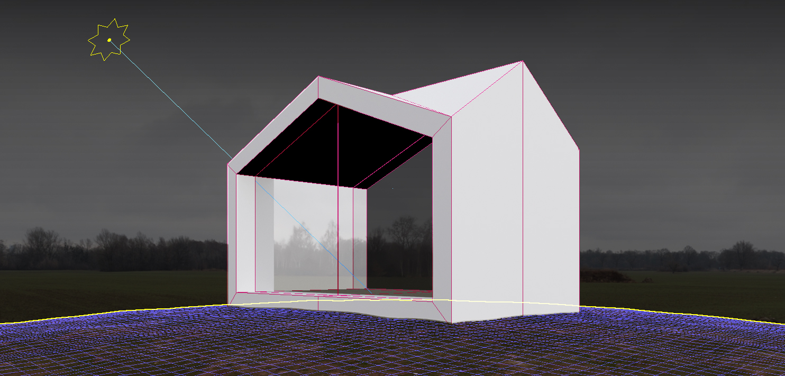
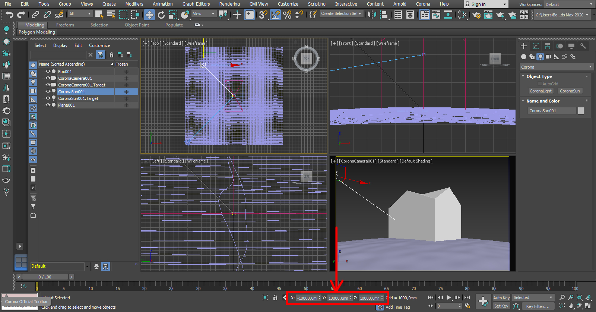
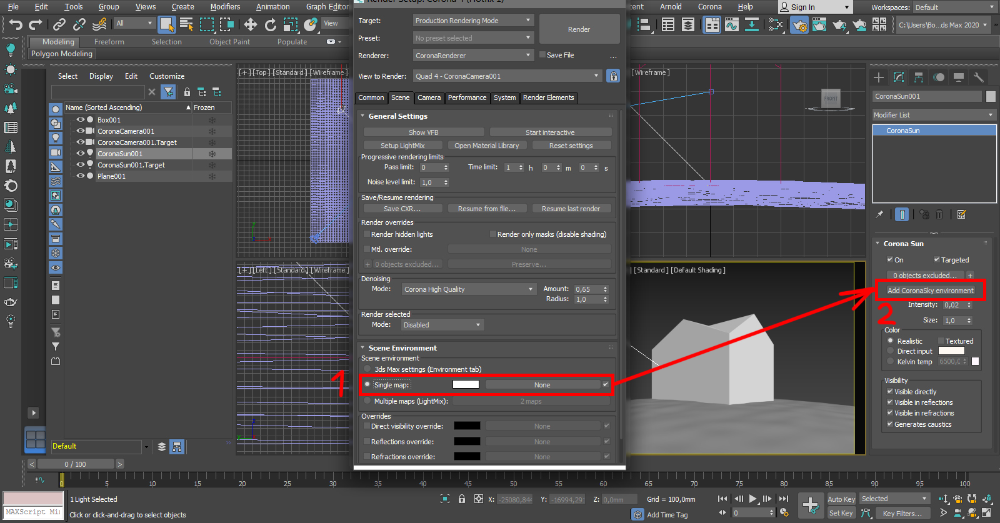
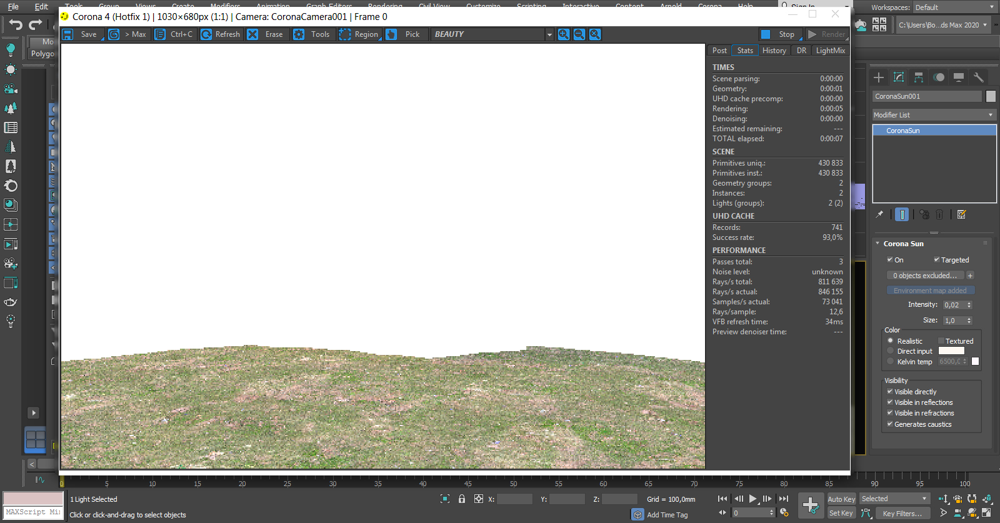
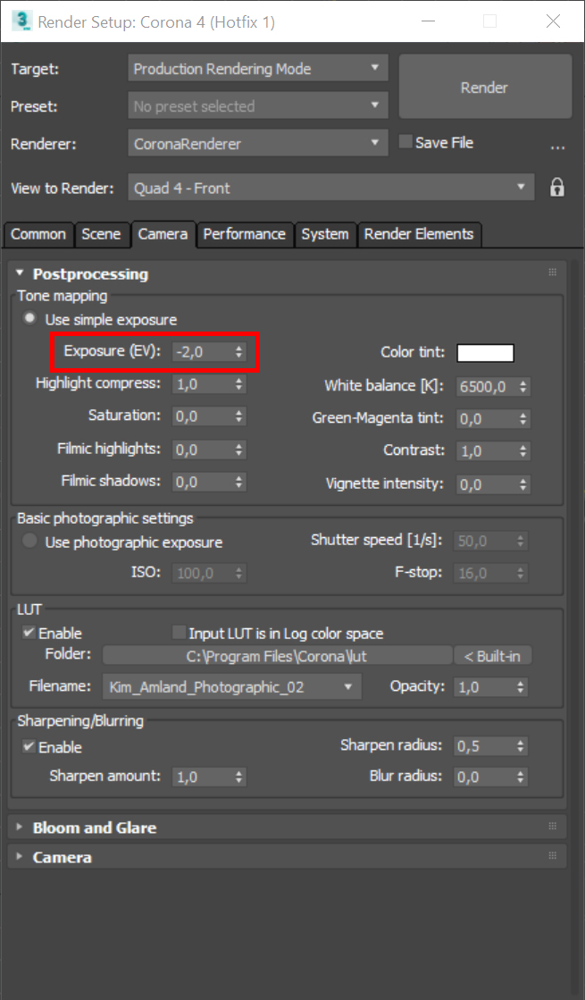
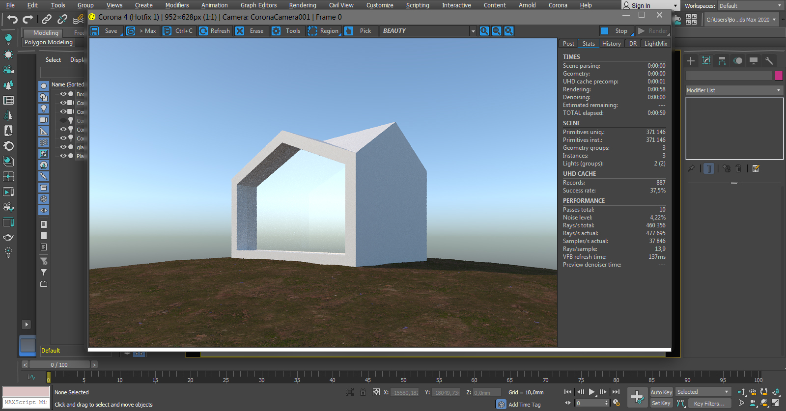
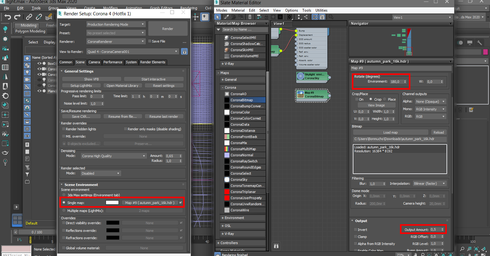
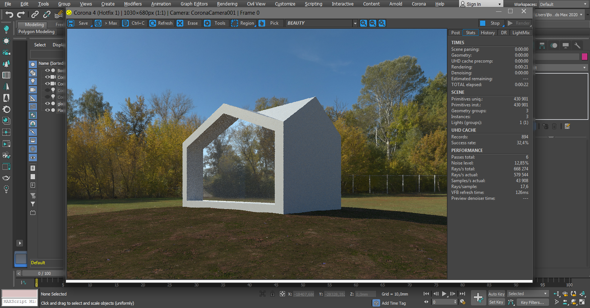
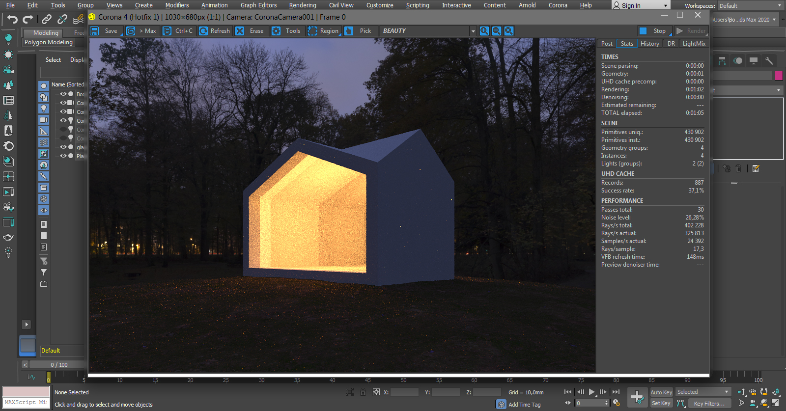
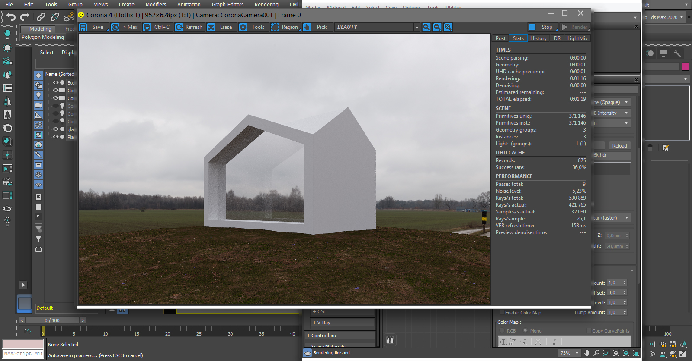

import { Aside } from '@astrojs/starlight/components';

Вот вы импортировали модель из ArchiCAD и настроили её по [инструкции](../export-import/), вроде бы всё выглядит ок. Но любой 🏨 диванный тридэмаксист-перфекционист скажет вам, что всё сделано через жопу, и будет прав! 

Но мы же не стремимся к идеалу, а просто делаем нормально с минимальными трудозатратами. А при связке ArchiCAD + Max какого-то туманного идеала вообще почти невозможно достичь.

Для настройки естественного освещения в архитектурной визуализации есть два основных способа для экстерьеров: ☀️ Sun + Sky и HDRI.

В этой статье разберём, как использовать оба метода с Corona Render.

## Sun + Sky: Быстрое и простое решение

Самая обычная схема настройки освещения — **CoronaSun + CoronaSky**. Этот вариант быстро рендерится и позволяет гибко крутить положение солнца. 
Второй вариант — с использованием HDRI-карты — даёт более реалистичный свет, но дольше рендерится и требует поиск подходящей карты.

### Настройка Sun + Sky

1. Создайте источник света CoronaSun. Солнце состоит из двух частей: источника света и точки, в которую он направлен **(target)**.
2. Установите target в 0 по всем координатам, а источник света — на +10000 (координаты можно задать внизу справа 👇).

_Вот здесь внизу справа можно задать координаты._

3. Откройте настройки рендера **(F10)** и перейдите во вкладку **“Scene”**.
4. В выпадающем меню **“Scene Environment”** выберите **“Single map”**.
5. Добавьте **CoronaSky environment**.

6. Смотрим превью:

☀️ Солнце слишком сильно лупит светом, и всё рендерится очень светлым. Это связано с тем, что стандартные настройки Corona 
[заточены под интерьерные рендеры](https://coronarenderer.freshdesk.com/support/solutions/articles/5000516719-how-to-add-daylight-to-my-scene-). 

Чтобы всё выглядело ок, нужно поменять уровень экспозиции кадра:

1. Перейдите во вкладку **“Camera”** в настройках рендера **(F10)**.
2. Установите значение **“Exposure (EV)”** на **-2** или **-4** (ну или любое другое в промежутке от 0 до -4).

Теперь всё выглядит нормально:

Вот и вся базовая инфа по настройке освещения с помощью CoronaSun + CoronaSky.
   - Захотите сделать закат или рассвет — отпускаете солнце ниже.
   - Не нравится, как падают тени — двигаете солнце, крутите **Intensity** у всех объектов, чтобы добиться нужного уровня освещенности.
   
Всё! Остальные параметры солнца и неба можете загуглить сами.

## HDRI: Более реалистичное освещение

Этот вариант сложнее, но зато требует меньше настроек в 3ds Max. Вам нужно:

1. Скачать сферическую HDRI-карту с сайта [polyhaven.com](https://polyhaven.com/hdris). Всё бесплатно и без регистрации.
2. Вставить её вместо CoronaSky. Для этого:
   - Добавьте карту как **CoronaBitmap**.
   - Назовите её **Sky** (необязательно).
   - Перетащите в слот **Environment** и выберите **Instance**.

3. Настройте следующие параметры:
   - **Output Amount** в свойствах карты (вкладка Output) отвечает за интенсивность света.
   - **Environment** во вкладке Mapping отвечает за угол поворота карты.

<Aside type="caution">
При использовании HDRI не забудьте выключить CoronaSun, если он у вас был.
</Aside>

_Настройки HDRI карты._

_Дневное освещение с HDRI картой._

### Особенности использования HDRI

💫 HDRI создаёт крутые отражения неба в стекле и добавляет глубину освещению. Но:

- Рендерится дольше и может давать больше шума.
- Для вечернего или ночного освещения этот вариант просто топ, потому что солнце не видно, а шумы убираются за счёт искусственного освещения (фонари, свет из окон и т.д.).

_Ночное освещение с HDRI картой._

_Пасмурное освещение с HDRI картой._